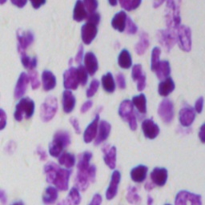
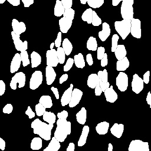
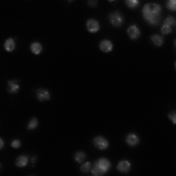
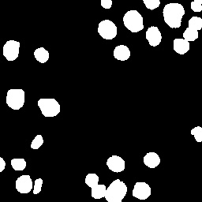

# Cell-Nuclei-Segmentation-in-TensorFlow-2.0

This repository contains the code for semantic segmentation of the cell nuclei on the 2018 Data Science Bowl dataset using UNET architecture in TensorFlow 2.0 framework.
The following models are used:
- [UNET](https://arxiv.org/abs/1505.04597)

Models to be used in future:
- RESUNET
- DEEPLABV3+
- more...

# Dataset
The 2018 Data Science Bowl dataset is used for this for training the UNET architecture. The dataset contains the 670 pairs of images and masks. All of these images are of different shapes and contains a variety of cell nuclei.
   
Download the dataset from here: [2018 DSB](www.kaggle.com/dataset/84613660e1f97d3b23a89deb1ae6199a0c795ec1f31e2934527a7f7aad7d8c37)

Original Image             |  Mask Image
:-------------------------:|:-------------------------:
  |  
  |  
