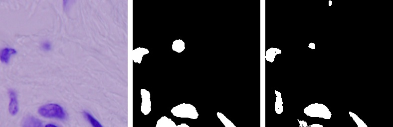
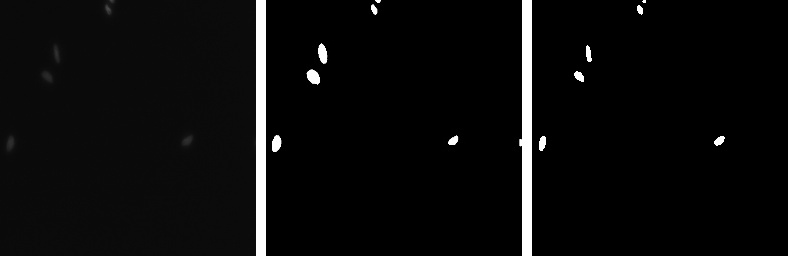
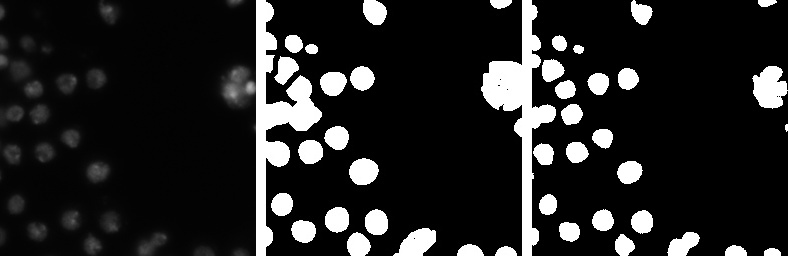
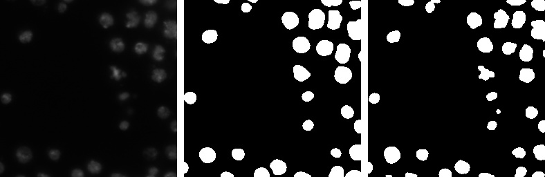

# UNET
This repository contains the code for semantic segmentation of the cell nuclei on the 2018 Data Science Bowl dataset using UNET architecture in TensorFlow 2.0 framework.

## Overview
- Architecture
- Dataset
- Results

## Architecture
The block diagram of the UNET architecture taken from the original paper.

|  |
| :--: |
| *U-Net Architecture* |

## Dataset
Download the dataset from here: [2018 DSB](www.kaggle.com/dataset/84613660e1f97d3b23a89deb1ae6199a0c795ec1f31e2934527a7f7aad7d8c37)

## Results
The images below contains:
1. Input image
2. Ground truth 
3. Predicted mask

|  |
| :--: |
|  |
|  |
|  |
